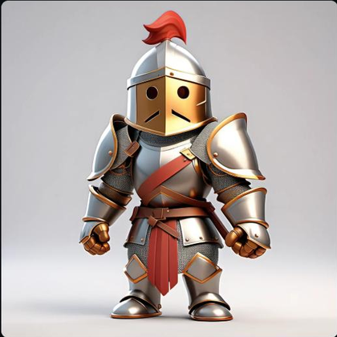
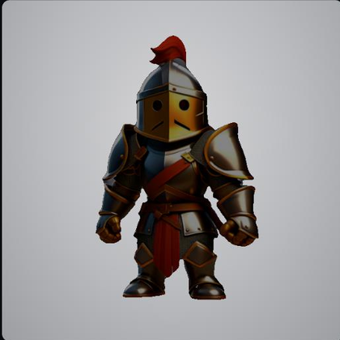
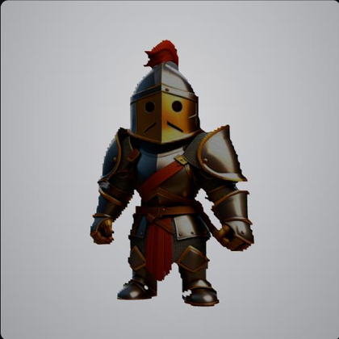
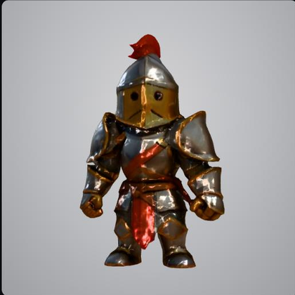

# InterForge

**A free, local, open-source AI game-asset pipeline.** Turn a text prompt into a
textured 3D model — concept art, directional sprites, and a game-ready `.glb` —
entirely on your own machine. No subscriptions, no cloud, no data leaving your PC.

> ⚠️ **Work in progress.** InterForge is under active development and not yet
> feature-complete. Expect rough edges. See [`docs/ROADMAP.md`](docs/ROADMAP.md).

---

## One concept, three modes

Most generators pick a single output format and make you live with it. A
background prop does not need the triangles a hero character does, so the same
locked concept goes down whichever branch the asset actually warrants.

| Concept | 2D sprite | 2.5D relief | 3D mesh |
|:---:|:---:|:---:|:---:|
|  |  |  |  |
| SDXL, background stripped | 2 tris · 4 verts | 14,282 tris · 7,484 verts | 20,344 tris · 15,548 verts |
| the locked source | a textured quad — still a `.glb` | solid from the front, hollow behind | geometry all the way around |

Counts are read from the glTF accessors, not estimated. Every mesh above came
out of the concept plate to its left; none of it was remodelled by hand.

**A sprite is still a GLB.** All three routes end in the same file format, so a
2D asset drops into the same engine pipeline as a 3D one.

> **On the 2.5D route:** a relief is built by pushing each pixel back by its
> depth, so wherever the depth map jumps — a pauldron against the background —
> it stretches a skirt of long thin triangles across the gap. Roughly 3% of
> faces, each 6–26× longer than any real edge. Culling those by edge length is
> on the roadmap; until then a relief export may need a pass. The full 3D route
> has none of it (longest edge under 2× the median).

---

## Why local

- **Metered tools punish iteration.** Cloud generators bill per generation, so
  the fortieth attempt costs the same as the first. Here the marginal cost of
  trying again is zero, which changes how you work more than any feature does.
- **Your concepts stay yours.** Nothing is uploaded — no prompt, no reference
  image, no output — which matters if you are working on something unannounced.
- **It still works offline.** Once the weights are downloaded there is no
  service to be rate-limited by, deprecated under you, or priced out of.
- **It fits an 8 GB card.** A VRAM arbiter keeps exactly one heavy model
  resident at a time, so an RTX 3070 runs the whole pipeline rather than
  running out halfway through.

---

## What it does

InterForge is a desktop app that walks an asset through a staged pipeline:

| Stage | What it does |
|-------|--------------|
| **Prospect** | Generate concept art from a text prompt (SDXL / DreamShaper XL via `diffusers`), optionally guided by a reference image (IP-Adapter) and pose (ControlNet). Pick the best image and lock it. |
| **Smelt** | Turn the locked concept into directional views / sprite frames (front, back, left, right) for 2D sprites or downstream 3D. |
| **Forge** | Produce geometry from the locked image. The 3D route uses **Stable Fast 3D (SF3D)** — a single image → UV-textured mesh in one pass. Also supports 2.5D depth relief, flat billboard, and 2D-only (no mesh) routes. Exports `.glb`. |
| **Anvil** | A sketch/storyboard board for planning assets. |

Models are **downloaded on first run** (via the in-app setup wizard) — no weights
are shipped in this repo.

## Tech stack

- **Desktop shell:** Tauri 2 (Rust) — uses the system WebView, ~10 MB vs Electron
- **Frontend:** React 18 + TypeScript + Vite (dev server on port **1420**)
- **Backend:** Python 3.11 + FastAPI + uvicorn (API on port **7842**), SSE job streaming
- **AI/ML:** PyTorch, `diffusers` (SDXL), `rembg`, `trimesh`, and Stable Fast 3D

## Hardware & platform support

The baseline target is an **8 GB NVIDIA GPU** (e.g. RTX 3070) with **CUDA 12.1**.
The VRAM arbiter keeps only one heavy model resident at a time so the pipeline
fits in 8 GB. A CPU-only install runs the frontend/API for development but cannot
perform GPU inference.

| Platform | UI | Image gen (SDXL) | 3D mesh (SF3D) |
|----------|----|------------------|-----------------|
| **Windows + NVIDIA (CUDA 12.1)** | ✅ | ✅ | ✅ — primary target |
| **Linux + NVIDIA (CUDA 12.1)** | ✅ | ✅ | ✅ — run the backend/frontend manually (see below) |
| **macOS** | ✅ | ⚠️ CPU-only, very slow | ❌ — see note |
| **Any, CPU-only** | ✅ | ⚠️ very slow | ❌ |

> **macOS note:** the desktop UI runs, but inference is currently **CUDA-only** and
> falls back to CPU (no Metal/MPS acceleration yet). SF3D's mesh-texture step is a
> CUDA extension that doesn't build on macOS, so the 3D pipeline won't run there.
> Metal/MPS support is on the [roadmap](docs/ROADMAP.md).

---

## Getting started

### Prerequisites

1. **Node.js** 18+ and npm
2. **Rust toolchain** (for Tauri) — install via [rustup](https://rustup.rs/)
3. **Python 3.11** (specifically 3.11 — see `.python-version`; newer versions lack some ML wheels)
4. An **NVIDIA GPU + CUDA 12.1** for inference (optional for UI-only dev)

### 1. Frontend

```bash
npm install
```

### 2. Backend (Python)

```bash
cd interforge-backend

# Create and activate a virtual environment (Python 3.11)
py -3.11 -m venv .venv
.venv\Scripts\activate        # Windows
# source .venv/bin/activate   # macOS / Linux

# Install PyTorch FIRST with the matching CUDA wheel:
pip install torch --index-url https://download.pytorch.org/whl/cu121
#   (CPU-only dev, no inference:  pip install torch)

# Then the rest of the backend deps:
pip install -r requirements.txt

# Finally, Stable Fast 3D (the 3D engine — GPU only, installs from git):
pip install git+https://github.com/Stability-AI/stable-fast-3d.git
```

> See [`requirements.txt`](interforge-backend/requirements.txt) for the full,
> ordered install notes. `torch` and SF3D are intentionally not in that file
> because they need special index URLs / git and can't resolve from plain PyPI.

### 3. Run it

**Full desktop app** (Tauri spawns the backend automatically):

```bash
npm run tauri dev
```

**Browser-only dev** (backend + Vite together, open http://localhost:1420):

```powershell
# Windows
./run-dev.ps1
```

```bash
# Linux / macOS
./run-dev.sh          # Ctrl-C stops both processes
```

`run-dev.sh` prefers `interforge-backend/.venv`'s Python, then `python3.11`. If
you'd rather run the two processes by hand:

```bash
# terminal 1 — backend
cd interforge-backend && python3.11 -m uvicorn main:app --host 127.0.0.1 --port 7842
# terminal 2 — frontend
npm run dev
```

### 4. First launch

On first run, open the **setup wizard** in-app to download the required model
weights (SDXL checkpoint, ControlNet, IP-Adapter). These are large (several GB)
and cached locally under `interforge-backend/models/` (git-ignored).

---

## Project layout

```
interforge-NEW/
├── src/                  React + TypeScript frontend
├── src-tauri/            Tauri 2 (Rust) desktop shell
├── interforge-backend/   FastAPI + Python inference backend
│   ├── api/              HTTP routes (prospect, smelt, forge, publish, setup, dev)
│   ├── core/             job manager, SSE, config, profiler
│   ├── workers/          pipeline job runners (prospect / smelt / forge / setup)
│   ├── inference/        model engines (SDXL ForgeEngine, SF3DEngine, depth)
│   ├── masterforge/      asset-type rules engine (prompts, styles, presets)
│   └── tests/            pytest unit + integration tests
└── docs/                 roadmap, dev log, phase notes (archive/ = legacy)
```

## Testing

```bash
cd interforge-backend
python -m pytest        # backend unit + integration tests

# from repo root — frontend type-check
npm run build           # runs tsc && vite build
```

## Roadmap

Summarised from [`docs/ROADMAP.md`](docs/ROADMAP.md), which stays authoritative.

**Shipped**
- Prospect, Smelt, Forge and Anvil, end to end
- Stable Fast 3D — single image to UV-textured GLB
- Direct inference via `diffusers`; ComfyUI removed entirely
- VRAM arbiter — one heavy model resident, so 8 GB is enough
- Pluggable model registry; drop your own checkpoints in
- IP-Adapter identity, ControlNet pose, LoRA support

**Up next**
- Linux dev launcher to match the Windows one — closest to done
- macOS: an MPS/Metal device path and a non-CUDA texture bake
- InstantMesh as a 16 GB tier — fixes SF3D's shallow back
- Speed mode via LCM LoRA — roughly 12–15 steps instead of 30
- State persistence, so restarting the app does not lose work
- True FBX export via headless Blender
- Cull depth-discontinuity spikes inside the 2.5D relief route

**Later**
- Sprite animation — walk cycles, Godot `.tres` and Unity metadata
- Rigging hints — landmarks to proxy bones in the GLB
- LoRA fine-tuning on your own art style

---

## License

InterForge's **source code** is licensed under the [MIT License](LICENSE).

The **AI models and weights** it downloads and uses are governed by their own
separate licenses — see [`LICENSES.md`](LICENSES.md). Those may restrict
commercial use of the models and their outputs regardless of the code license.

## Contributing

This is an open-source project — issues and pull requests are welcome. Please
keep changes scoped and run the tests above before opening a PR.
